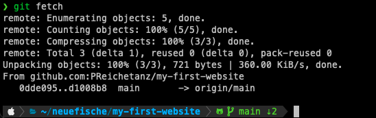
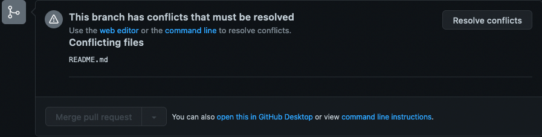
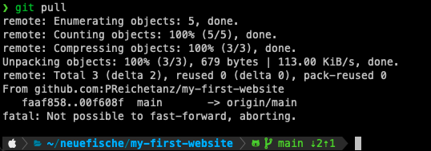
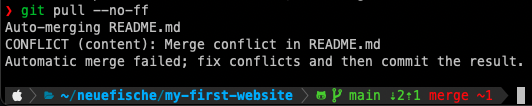
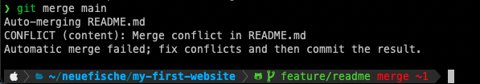

# Git Advanced

## Learning Objectives

- [ ] deepen understanding of git in general
 - [ ] `git fetch`
 - [ ] `git pull`
- [ ] understand whz and how git conflicts happen
- [ ] know ow to combine branches :
 - [ ] `git merge`
 - [ ] `git rebase` / `git pull --rebase`
- [ ] know how to resolve git conflicts

--

## Understanding Advanced Git Commands

### `git fetch`

To chech wether your local branches are up to date with the remote repository (by default:
`origin`), use `git fetch`.

If there are any differeneces,

- `git fetch` update the remote-tracking branches
- this means that local branch knows about all recent remote changes, but **does not contain these changes yet**
- you still need to merge these changes manually (using `git pull` or `git merge`).

> 💡 To see exactly which branches are up to date with origin/main, use `git fetch -v`.

### `git merge`

To join two branchees together, you can use `git merge`.

Make sure to 

- run `git fetch` first of you want to merge a remote branch
- switch to the branch where you want to incorporate the changes
- run `git merge <branchname>`

> 💡 Note that `git merge` is a fast-forward merge by default, which means that it will not create a 
> merge commit if the history is clean.

> 💡 If a fast-froward merg isn't possible, `git merge` will create a merge commit , that 
> incorporates the change. To avoid this and keep a clean history, you can use 
> [git rebase] (git-advanced.md#git-rebase).

### `git pull`

You can use `git pukk` to fetch changes from a remote repositores **and ** merge them into the current branc.

This is possible due to the fact that `git pull` runs `git fetch` and then `git merge`.

![git pull terminal output positive] (assets/git-pull.png)

### `git rebase`

To join two branches together, you can also use `git rebase`. In contrats to `git merge`, it doesn't
create a merge commit, which results in a cleaner git history.

This strategy first applies all the changes of the branch we are rebasing to (the branch used after
`rebase` command). Then it applies th changes of the branch we are rebasing from (the current
branch) on top of it commit by commit.

This is like "replaying" your latest changes on top of the changes from the other branch.

To rebase,

- switch to the branch where you angt to incorporate the changes
- use `git rebase main` to incorporate the changes from the `main` branch into the branch you
switch to
- is a conflict occurs,
 - [see below how to solve it in VSCode](git-advanced.md#how-to-solve-conflicts-in-vscode) and
 - [how to finish rebasing](git-advanced.md#option-2-git-rebase)

---

## How to Solve Conflict.

When you create a PR and want to merg the feature branch into the main branch, it happens that 
somebody made changes to the same line of code you were working on. Git cannot decide which code is
the right one and makes it as a conflict.

Conflicts have to be solved manually by developers.

### How to solve conflicts in VSCode

If a merge conflict occurs, you can use VSCode to solve it: 
- go to the `Source Control` Tab of VSCode, and open the file marked with ❗️:

- choose one option to resolve the merge conflict:
 - `Accept Current Changes`: kepp content of the feature branch
 - `Accept Incoming Changes`: keep content of the main branch (because we are mergin main into the
 feature branch)
 -`Accept Both Changes`: keep both changes
- save the file and the stage that the changes (`git-advanced.md#option-1-git-merge) or
[git rebase](git-advanced.md#option-2-git-rebase)

---

### How Common Conflict Emerge

#### Scenario 1: Feature Branch differs from Main Branch

There are two ways to handle the conflict:

- solve the conflict locally ([see explanation below](assets/conflicts-message.png))
- solve the conflict directly on Github
 ([see explanation below] (git-advanced.md#solving-the-conflict-remote-on-github))

#### Scenario 2: Fatal Error on `git pull`

Using `git pull` can result in the error message `fatal: Not possuble to fast-forward, aborting`.
This happens when:

- You have done at least one commit locally
- In the meantime, somebodey else has committed to the branch you want to pull.
- The problem is that git does not know which commit(s) came first.

To solve the conflict, follow these steps:

- `git pull --no-ff`
- resolve merge conflicts (if any)
 ([see explanation below](git-advanced.md#how-to-solve-conflicts-in-vscode))]
- `git commit -m "resolve merge conflict"
- `git push`

---

### Solve Conflicts

#### Solve the conflict locally

##### Option 1: `git merge`

If the feature branche has conflicts with the ,main branch, you can use `git merge` to solve the
conflict:

- go to feature branch
- use `git merge main` to merge main  branch into the feature branch
- the terminal will output something like this:

 

 - resolve the conflict in VSCode
  ([as mentioned above](git-advanced.md#how-to-solve-conflicts-in-vscode))
 - push the feature branch to GitHub
 - conflict solved: you can now merge the PR on GitHub 🎉

##### Option 2: `git rebase`

